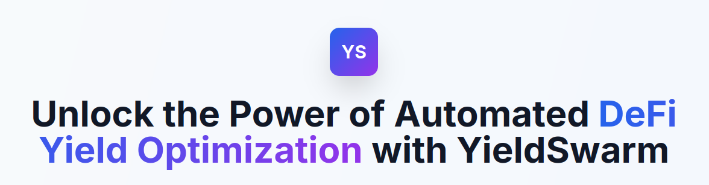

<p align="center">
  
</p>

# YieldSwarm: An AI-Powered Multi-Chain DeFi Yield Optimizer

<p align="center">
  <strong>An intelligent multi-agent system that autonomously discovers, analyzes, and executes optimal yield farming strategies across multiple blockchain networks using JuliaOS's swarm intelligence and AI capabilities.</strong>
</p>

---

## 📖 Table of Contents

- [🎯 Project Overview](#-project-overview)
- [✨ Core Features](#-core-features)
- [🏗️ System Architecture](#️-system-architecture)
- [📋 Prerequisites](#-prerequisites)
- [🛠️ Setup & Installation](#️-setup--installation)
- [🚀 Running the Application](#-running-the-application)
- [🖥️ Using the Dashboard: A Step-by-Step Guide](#️-using-the-dashboard-a-step-by-step-guide)
  - [Step 1: Create the Discovery Agent](#step-1-create-the-discovery-agent)
  - [Step 2: Create the Analysis Agent](#step-2-create-the-analysis-agent)
  - [Step 3: Create the Risk Agent](#step-3-create-the-risk-agent)
  - [Step 4: Create a Swarm](#step-4-create-a-swarm)
  - [Step 5: Start the Swarm & Agents](#step-5-start-the-swarm--agents)
  - [Step 6: Monitor the System](#step-6-monitor-the-system)
- [⚙️ Project Structure](#️-project-structure)
- [📄 License](#-license)

---

## 🎯 Project Overview

YieldSwarm is a sophisticated DeFi yield optimization platform built for the JuliaOS bounty. It leverages a powerful combination of a high-performance Julia backend and a Node.js orchestration layer to power a swarm of autonomous AI agents. These agents work together to monitor, analyze, and manage yield strategies across multiple blockchains, aiming to deliver optimized returns while managing risk.

## ✨ Core Features

-   **Autonomous Agent Architecture:** Specialized agents for discovery, analysis, and risk management.
-   **AI-Powered Intelligence:** Integrates with Large Language Models (LLMs) for advanced opportunity discovery, filtering, and risk assessment.
-   **High-Performance Optimization:** Utilizes a Julia backend with the `HiGHS` solver for rapid and efficient portfolio optimization.
-   **Multi-Chain Capability:** Designed to monitor and operate across various blockchain networks.
-   **Real-Time Web Dashboard:** An intuitive UI for managing the agent swarm and visualizing opportunities, allocations, and alerts in real-time.
-   **Robust & Resilient:** Features fallback mechanisms that allow agents to revert to traditional methods if AI systems are unavailable, ensuring constant operation.

## 🏗️ System Architecture

YieldSwarm is built on a three-layer architecture:

1.  **Julia Backend (TCP Server):** The computational core that handles portfolio optimization and LLM API calls.
2.  **Node.js Orchestrator (API & WebSocket Server):** The central nervous system that manages agents, serves the API, and pushes real-time data to the UI.
3.  **Vanilla JS Frontend (Web Dashboard):** The command center for user interaction, management, and real-time data visualization.

## 📋 Prerequisites

Before you begin, ensure you have the following installed:

-   [Node.js](https://nodejs.org/) (v18 or later)
-   [pnpm](https://pnpm.io/installation) (recommended package manager)
-   [Julia](https://julialang.org/downloads/) (v1.8 or later)
-   [Git](https://git-scm.com/)

## 🛠️ Setup & Installation

1.  **Clone the Repository**
    ```bash
    git clone https://github.com/DavidNzube101/YieldSwarm.git
    cd MCDYOS
    ```

2.  **Install Node.js Dependencies**
    ```bash
    pnpm install
    ```

3.  **Set Up Environment Variables**
    Create a `test.env` file in the root directory by copying the example:
    ```bash
    cp env.example test.env
    ```
    Open `test.env` and add your Hugging Face API token. This is **required** for the AI features to work.
    ```env
    # ... other variables
    HF_TOKEN=YOUR_HUGGINGFACE_ACCESS_TOKEN
    ```

4.  **Build the Project**
    This command compiles the TypeScript code and copies the UI files to the `dist` directory.
    ```bash
    pnpm build
    ```

## 🚀 Running the Application

To run YieldSwarm, you need to start both the Julia and Node.js servers in separate terminal windows.

**Terminal 1: Start the Julia Backend**
```bash
julia backend/julia_server.jl
```
You should see a confirmation message: `Julia backend listening on 127.0.0.1:8052`.

**Terminal 2: Start the Node.js Server**
```bash
pnpm start:api
```
You should see confirmation messages that the Swarm Coordinator is initialized and the API server is listening on port 3000.

**Terminal 3: Access the Dashboard**
Open your web browser and navigate to:
[**http://localhost:3000**](http://localhost:3000)

## 🖥️ Using the Dashboard: A Step-by-Step Guide

The web dashboard is your command center. Here’s how to get the system running.

### Step 1: Create the Discovery Agent

This agent finds yield opportunities.

1.  In the **Agent Management** panel, click the **"Create Agent"** button.
2.  Fill out the form:
    -   **Agent Name:** `DiscoveryAgent`
    -   **Agent Type:** `discovery`
    -   **Chain:** `solana`
3.  Click **"Create Agent"**.

### Step 2: Create the Analysis Agent

This agent analyzes opportunities and optimizes the portfolio.

1.  Click **"Create Agent"** again.
2.  Fill out the form:
    -   **Agent Name:** `AnalysisAgent`
    -   **Agent Type:** `analysis`
    -   **Chain:** `solana`
3.  Click **"Create Agent"**.

### Step 3: Create the Risk Agent

This agent monitors the portfolio for risks.

1.  Click **"Create Agent"** one more time.
2.  Fill out the form:
    -   **Agent Name:** `RiskAgent`
    -   **Agent Type:** `risk`
    -   **Chain:** `solana`
3.  Click **"Create Agent"**.

You should now see all three agents listed in the **Agent Management** panel with a status of `stopped`.

### Step 4: Create a Swarm

The swarm will coordinate the agents.

1.  In the **Swarm Management** panel, click the **"Create Swarm"** button.
2.  Fill out the form:
    -   **Swarm Name:** `Swarm1`
    -   **Optimization Algorithm:** `Morden Portfolio Theory` _(only algorithm currently supported)_
    -   **Available Agents:** Check the box next to **`AnalysisAgent`**.
3.  Click **"Create Swarm"**.

### Step 5: Start the Swarm & Agents

Activate the system by starting the swarm and then the individual agents.

1.  **Start the Swarm:** In the **Swarm Management** panel, find `Swarm1` and click its **"Start"** button.
2.  **Start the Agents:** In the **Agent Management** panel, click the **"Start"** button for each of the three agents: `DiscoveryAgent`, `AnalysisAgent`, and `RiskAgent`. (_note: you would need to click the refresh button in the agents panel and swarm panel to refresh their status from `stopped` to `running`._)

### Step 6: Monitor the System

The system is now live! You will see the dashboard panels populate in the following order:

1.  **Live Opportunity Feed:** The `DiscoveryAgent` will immediately start finding opportunities (using mock data by default), and this panel will fill up.
2.  **Portfolio Allocation:** After a short delay, the `AnalysisAgent` will collect the opportunities, send them to the Julia backend for optimization, and display the resulting portfolio allocation here.
3.  **Risk Alerts:** The `RiskAgent` will analyze the new portfolio and post any relevant risk warnings in this panel.
4.  **System Logs:** This panel provides a real-time log of all major events occurring in the system.

Congratulations, you are now running an autonomous, AI-powered yield optimization swarm!

## ⚙️ Project Structure

```
.
├── backend/          # Node.js backend and Julia server
│   ├── api.ts
│   ├── julia_server.jl
│   └── ...
├── src/
│   ├── agents/       # TypeScript Agent implementations
│   ├── cli/          # Command-line interface
│   ├── defi/         # DeFi protocol integrations
│   ├── swarm/        # Swarm coordination logic
│   └── yieldswarm-ui/ # Frontend dashboard files
├── config/           # Chain and DEX configurations
├── data/             # Data persistence for agents/swarms
├── test/             # Unit and integration tests
├── README.md         # This file
└── package.json
```

## 📄 License

This project is licensed under the MIT License. See the `LICENSE` file for details.